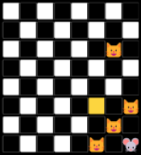

# Kočky a myš 
Tento projekt byl vytvořen jako zápočtový program k předmětu NPRG030 Programování 1 v prvním semestru mého studia informatiky na Matematicko-fyzikální fakultě.
Jedná se o můj úplně první větší projekt, buďte proto shovívaví.
## O hře
Kočka a myš, více známá pod názvem Fox and the Hounds nebo českým vlk a ovečky, je desková hra
dvou hráčů s úplnou informací, která se hraje na šachovnici; my zvolíme klasické rozměry 8x8. První
z hráčů hraje za myš a snaží se uniknout kočkám, neboli dosáhnout druhého konce hrací plochy. Druhý
hráč se naopak snaží pomocí svých čtyř figurek – koček – myš polapit, zabránit jí v dosažení svého konce
šachovnice.
## Počáteční pozice
Hraje se pouze na polích stejné barvy, v tomto programu jsou to pouze pole bílá.
Hráč hrající za myš disponuje jedinou figurkou, která začíná na libovolném ze čtyř
bílých polí na jedné straně šachovnice. Druhý hráč má čtyři figurky koček, které
jsou zpočátku rozmístěné na každém z polí druhé strany šachovnice.

# Pravidla
Hráči se střídají po tazích, začíná myš. Dovolené jsou pouze tahy o jedno pole
šikmo na pole stejné barvy.
Myš může táhnout na libovolné ze sousedních bílých polí (není-li obsazené některou z koček) a to
dopředu i dozadu. Poté následuje tah koček.
Kočky ve svém tahu můžou táhnout pouze jednou ze svých figurek, a to pouze vpřed (resp. z našeho
pohledu dolu) vlevo nebo vpravo (opět pouze pokud není pole obsazené myší nebo jinou
z koček). Vyhazování nebo přeskakování figurek není povoleno. Po skončení tahu koček opět následuje
tah myši a takto se hráči střídají.
Konec hry nastane tehdy, pokud se myš dostane na libovolné pole na druhé straně šachovnice (tam,
kde začínaly kočky) – vítězství myši.

Nebo pokud kočky uvězní myš (ať už mezi sebou nebo u
některé „nevítězné“ stěny), čili myš se ve svém tahu nemůže pohnout na žádnou ze čtyř stran - vítězství koček.

## Spuštění
Spusťe soubor Kocky_a_mys.py. Program se ovládá přímo z konzole, kam je také zobrazován stav hry. 
Proto je potřeba, aby konzole podporovala unicode a ideálně měla monospace font. 
## Ovládání
Na začátku si hráč vybere, zda chce hrát za kočky nebo za myš, za oponenta
bude hrát počítač. Své figurky pak bude ovládat pokyny: napíše pokyn podle
směru jakým chce táhnout a stiskne enter. Poté počká než oponent (počítač)
provede svůj tah.
Myš má pokyny následující: 1 pro pohyb vzad vlevo (z našeho pohledu vlevo
dolů), 3 pro vzad vpravo (vpravo dolů), 7 pro pohyb vpřed vlevo (nahoru vlevo)
a 9 pro vpřed vpravo (nahoru doprava). Můžeme si představit, že pokud by se
myš nacházela na numerické klávesnici na číslici 5, pak právě klávesy 1 3 7 a 9
by představovaly validní tahy.

Pokud se hráč rozhodne hrát za kočky, má k dispozici dvě zaměnitelné sady pokynů. První sada jsou
písmena asdf a jklů (nebo znak ; namísto ů pro anglický layout), podle rozložení prstů při psaní všemi
deseti. Písmena a, s jsou pokyny první kočce: a znamená pohyb vlevo,s pohyb vpravo (resp. vlevo nebo
vpravo směrem dolů, to je však jediný směr, kterým se kočky mohou pohybovat, směr dolů je proto
implicitní) df jsou pokyny druhé kočce, obdobně d je vlevo, f vpravo. Písmena jk jsou pokyny kočce třetí
(j vlevo, k vpravo) a klávesami l ů ovládáme poslední kočku (l vlevo, ů vpravo).
Protože tenhle způsob ovládání může být nekomfortní, je zde ještě ekvivalentní způsob zápisu pokynů
a to dvojciferným číslem: první z číslic označuje číslo kočky (1 až 4) a druhé směr: 1 pro pohyb vlevo, 2
pro pohyb vpravo. Např. pohyb druhou kočkou (K2) směrem (dolů) vlevo by se zařídil pokynem 21.
Ekvivalentním pokynem by bylo písmeno d.
### Příklady:
Pokud bychom hráli za myš a chtěli kupříkladu táhnout nejprve vpřed vlevo,
pak dvakrát vpřed vpravo a nakonec jednou vzad vpravo, do
terminálu bychom tyto příkazy zapsali takto:

7 \<enter\> … (počkáme na tah počítače) 9 \<enter\> … 9 \<enter\> … 3 \<enter\>

Pokud bychom hráli za kočky a
z výchozí pozice bychom chtěli první kočkou táhnout
nejprve vpravo a pak vlevo a potom druhou kočkou vlevo a
třetí kočkou vpravo, příkazy, které bychom psali do
terminálu by vypadaly takto:

s \<enter\> … (tah počítače) a \<enter\> … d \<enter\> … k \<enter\>

Nebo druhá možnost: 

12 \<enter\> … 11 \<enter\> … 21 \<enter\> … 32 \<enter\>. 

Bylo by také možné oba
způsoby psaní pokynů kočkám kombinovat.

Ve svém tahu lze také partii vzdát příkazem vzdát. Po skončení hry lze zvolit další partii nebo program
ukončit. Pokud zapomenete některý z příkazů, napište pokyn help jenž vypíše všechny možné příkazy.
## Obtížnost
K dispozici jsou tři módy: 

1) ruthless, protivník nedělá chyby

2) hard, protivník se snaží volit co nejlepší tahy, ale dá se obehrát

3) easy, protivník dělá chyby, výhra není nijak obtížná.

Ze začátku je nastavena obtížnost ruthless, lze změnit tak, že při svém tahu napíšete příkaz obtížnost nebo nastavení 
(pozor, malé počáteční písmeno) a poté hard nebo easy podle své volby. Pozor, obtížnost se restartuje na
ruthless pokaždé když program ukončíte.
